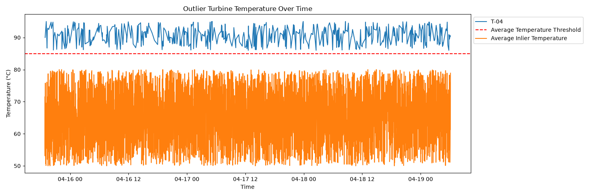
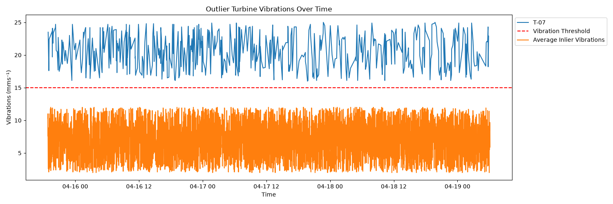

# IEUK Engineering Sector Skills Project

This project has been set by The Bright Network to be completed for the Internship Experience UK 2026 event

## Table of contents

- [Problem Statement](#Problem-Statement)
- [Analysis](#Analysis)
- [Solution](#Solution)

## Problem Statement

AeroGrid, a renewal energy provider managing a fleet of offshore wind turbines, has had failures in several of their turbines due to their server being unable to handle all the telemetry data being sent from the turbines. I have been provided 24 hours of turbine telemetry data which I must analyse to identify the failing turbines.
Once the failing machines have been identified, I must design a modern, scalable cloud system which can better handle the constant data being provided by the turbines so this problem can be avoided in the future

## Analysis

A turbine requires **urgent maintenance** if:
- Average Temperature exceeds **85 °c**
- Vibration levels spike above **15 mms⁻¹**

From these requirements, I have identified these following outliers

| Turbine ID | Turbine Average Temperature |
|:----------:|:---------------------------:|
| T-04       | 90.6 °c                     |

| Turbine ID | Turbine Average Vibrations |
|:----------:|:--------------------------:|
| T-07       | 20.6 mms⁻¹                 |

I have also produced graphs to show how these turbines differ from the inlier average

